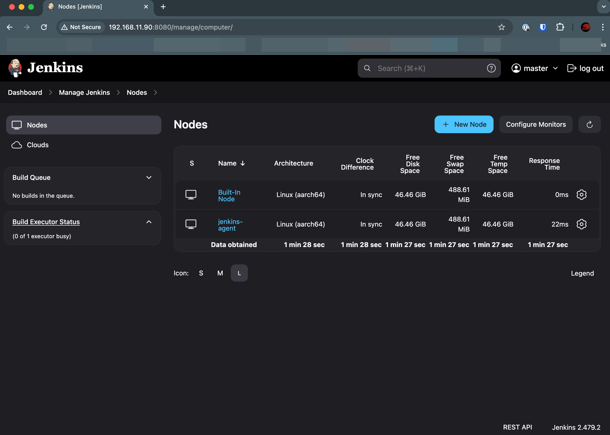
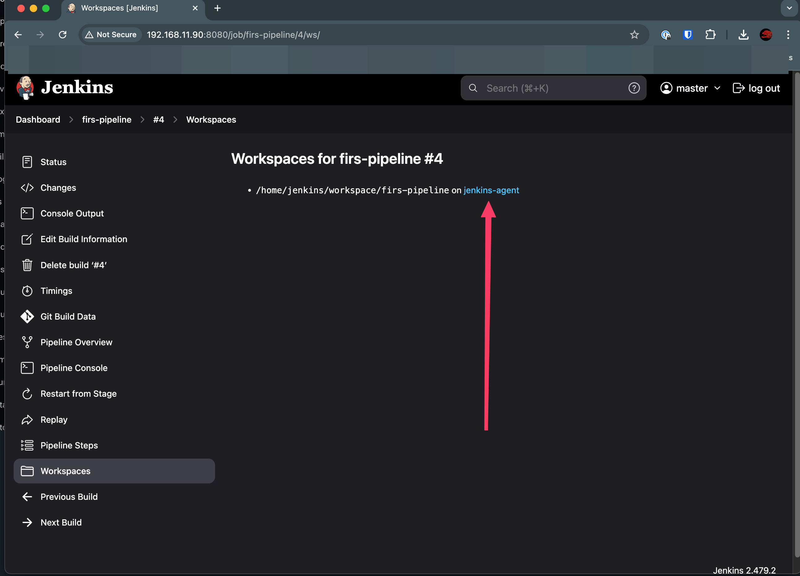
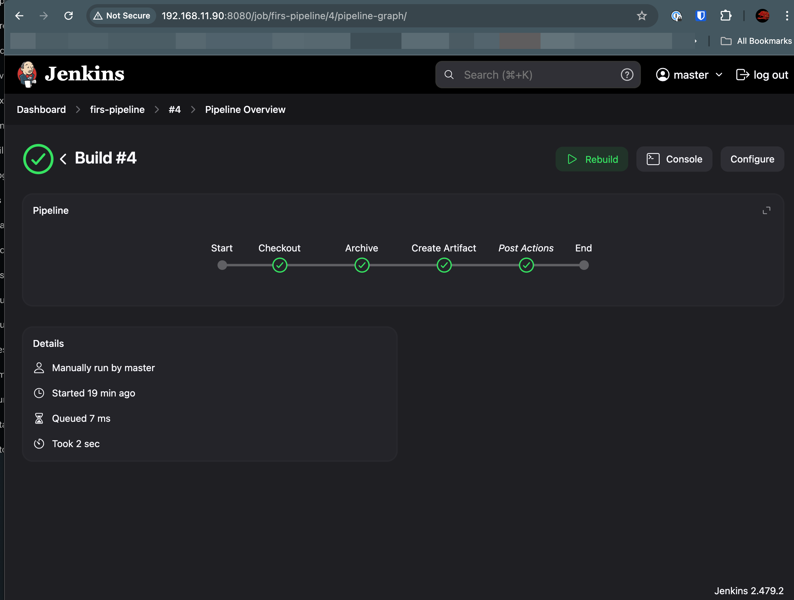
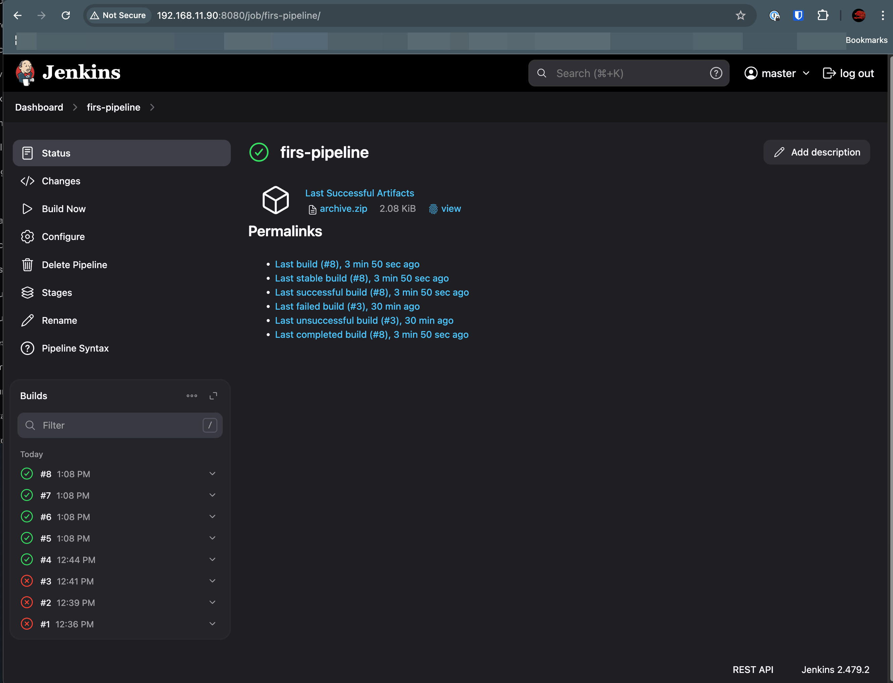

# HW-12 Jenkins
## Links:
- Official site docs: https://www.jenkins.io/projects/gsoc/2023/project-ideas/docker-compose-build/
- Jenkins in compose example: https://github.com/gounthar/MyFirstAndroidAppBuiltByJenkins/tree/main/jenkins

### For some reason, auto-adding of Jenkins agent to Jenkins master is not working, so I added it manually (I leave the file `casc.d/agents.yaml` in the repo for the next try :) )

### Screenshot of pipeline and Jenkins nodes:

  
Screenshots

  
  
  
  

