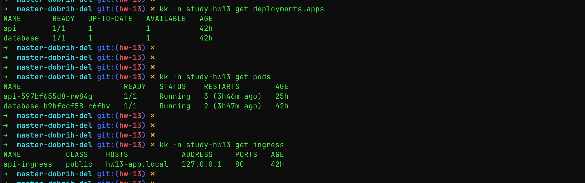
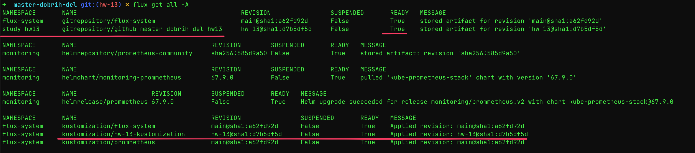
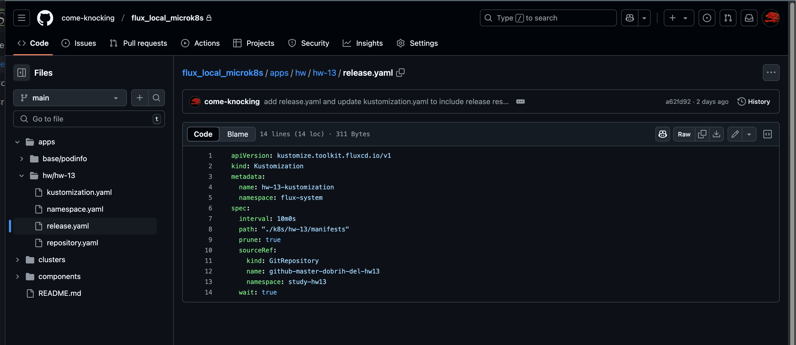
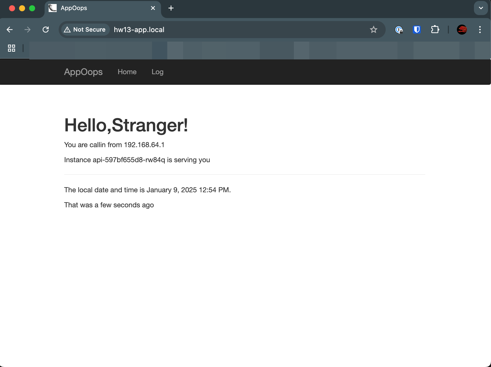
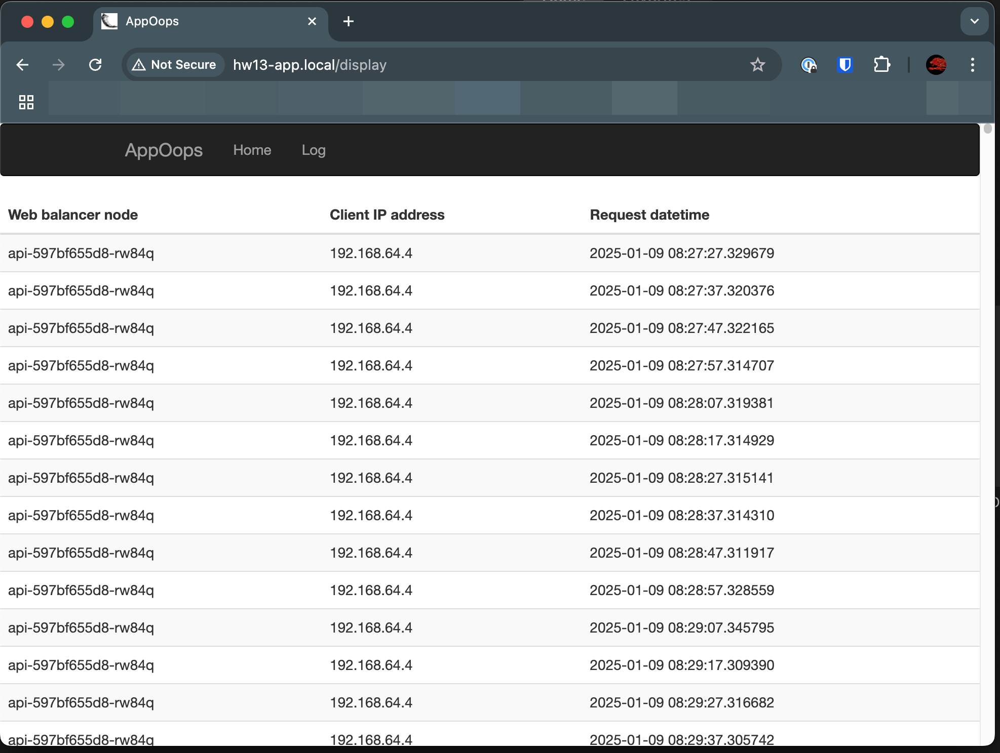

## HW-13 k8s-1
### Решил немного усложнить себе жизнь и деплоить через fluxcd
### манифесты ДЗ в папке manifests. 
### fluxcd в папке manifests-fluxcd, по причине "несекюрно", там только то, что касается этого ДЗ

  
Screenshots

### Screen kubectl:
  
### Screen fluxcd:
  
### Screen repo:
  
### Web-app screens:
  
  

